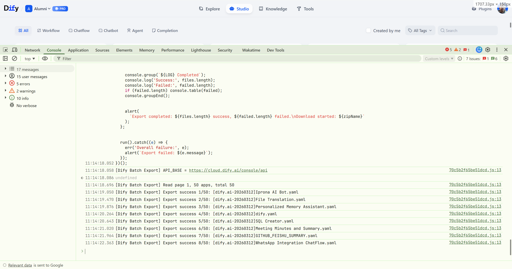

脚本用来在Dify工作流界面，批量请求Dify工作流导出，并打包成一个压缩包格式，后续使用解压zip文件，并导入dify工作流即可。

完全在本地运行，无隐私风险，运行代码前请进行检查，并使用可信ZIP源。

## 如何使用

直接在浏览器控制台运行

```
fetch('https://raw.githubusercontent.com/AuditAIH/dify-workflow-batch-export/refs/heads/main/export.js')
  .then(res => res.text())
  .then(script => eval(script));
```

## 或者复制源码

https://raw.githubusercontent.com/AuditAIH/dify-workflow-batch-export/refs/heads/main/export.js

直接粘贴在控制台运行


## Dify.AI

复制源码 [export-dify.ai.js](./export-dify.ai.js) 内容，在dify工作流界面控制台运行即可批量导出dify工作流.


